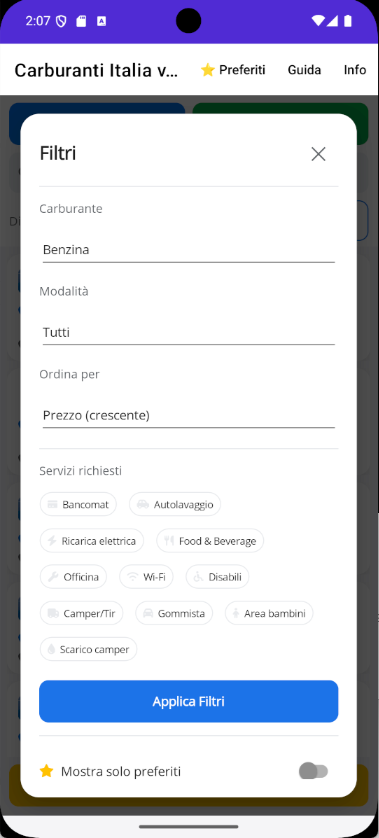

# 🚗 Carburanti Italia

App Android per consultare in tempo reale i **prezzi dei carburanti** in Italia.

---

## ✨ Funzionalità

- 🔍 Ricerca per **località** (Regione → Provincia → Comune)
- 📍 Ricerca per **posizione GPS** con raggio configurabile (5-100 km)
- 🔎 **Ricerca testuale** live su nome stazione, gestore e indirizzo
- ⛽ Filtri carburante: **Benzina, Gasolio, GPL, Metano** + speciali (**HVOlution, Blue Diesel, Supreme Diesel, Hi-Q, HiQ Perform+, Gasolio Premium / Oro / Speciale, Blue Super, Benzina WR 100, HVO100, HVO**) — Self / Servito / Tutti
- 🏪 Filtro per **servizi** (Bancomat, Autolavaggio, Bar, Ricarica elettrica…)
- 🔢 **Ordinamento**: prezzo ↑/↓, distanza, nome A-Z
- ⭐ **Preferiti** salvati sul telefono con pagina dedicata
- 🏷️ **Logo e bandiera** dei distributori
- 📍 **Indirizzo completo** di ogni stazione
- 🕒 **Orari di apertura** + badge **APERTO / CHIUSO**
- 🎯 **Action bar** nel dettaglio: Mappa, Naviga, Chiama, Email, Sito, Condividi
- 🔔 **Monitoraggio automatico** con notifiche in background
- 📖 Guida e Info integrate

---

## 📸 Screenshot

---

## 📥 Download

👉 [**Scarica l'ultima versione**](https://github.com/maxsassano/CarburantiItalia/releases/latest)

**Requisiti:** Android 7.0 (API 24) o superiore, connessione internet, GPS (opzionale)

**Installazione:**
1. Scarica `CarburantiItalia.apk`
2. Sul telefono: **Impostazioni → Sicurezza → Origini sconosciute** (attiva)
3. Apri l'APK → **Installa**

---

## 🚀 Come si usa

**Prima ricerca**
1. Seleziona **Regione, Provincia, Comune** — oppure salta direttamente al GPS
2. Scegli la **distanza** (5-100 km)
3. Tocca **🔍 Cerca per località** oppure **📡 Usa la mia posizione GPS**

> Quando usi il GPS, i picker di località si nascondono automaticamente per lasciare più spazio ai risultati.

**Ricerca testuale**
Digita il nome di una stazione, di un gestore o una via nella barra di ricerca per filtrare i risultati in tempo reale.

**Filtri avanzati** (tocca **☰ Filtri**)
- **Carburante**: Benzina, Gasolio, GPL, Metano + carburanti speciali (HVOlution, Blue Diesel, Supreme Diesel, Hi-Q, HiQ Perform+, Gasolio Premium / Oro / Speciale, Blue Super, Benzina WR 100, HVO100, HVO)
- **Modalità**: Self, Servito, Tutti
- **Ordina per**: Prezzo ↑/↓, Distanza, Nome A-Z
- **Servizi richiesti**: Bancomat, Autolavaggio, Ricarica elettrica, Food & Beverage, Officina, Wi-Fi, Disabili, Camper/Tir, Gommista, Area bambini, Scarico camper
- **Mostra solo preferiti**
- **Monitoraggio automatico** con soglia prezzo

**Dettaglio distributore** — Tocca una scheda per vedere:
- Logo, bandiera, badge **APERTO / CHIUSO**
- Indirizzo completo + coordinate GPS
- **Action bar**: Mappa, Naviga, Chiama, Email, Sito, Condividi
- Orari di apertura settimanali
- Servizi disponibili con icone
- Tutti i prezzi (Self / Servito)

**Preferiti**
Tocca la ⭐ su una scheda per aggiungerla ai preferiti. Tocca **⭐ Preferiti** nella toolbar in alto per aprire la pagina dedicata con tutte le stazioni salvate. In alternativa, apri **☰ Filtri → "Mostra solo preferiti"** per filtrare la lista corrente.

I preferiti sono salvati sul telefono e restano anche dopo la chiusura dell'app. Per rimuovere un preferito, tocca la stella gialla.

**Monitoraggio**
Attiva lo switch, imposta la **soglia prezzo**. L'app girerà in background e ti avviserà se trova un distributore sotto la soglia. Funziona anche ad app chiusa.

> ⚠️ Il monitoraggio in background consuma batteria. Attivalo solo quando ti serve.

---

## 🔌 Fonte dati

Tutti i prezzi provengono dall'**API pubblica del MIMIT** — Osservaprezzi Carburanti:
👉 https://carburanti.mise.gov.it

Gli indirizzi vengono completati con l'**anagrafica ufficiale degli impianti attivi** pubblicata dal MIMIT.

L'app **non è affiliata** al MIMIT né a marchi di carburante.

---

## ⚠️ Note

- La disponibilità e l'accuratezza dei prezzi dipendono dalle comunicazioni dei gestori al MIMIT.
- Alcune stazioni potrebbero non avere tutti i dati (telefono, orari, servizi) perché il gestore non li ha comunicati.
- L'app richiede i permessi: **Posizione** (per ricerca GPS e monitoraggio) e **Notifiche** (per avvisi prezzi).

---

## 📄 Licenza

MIT — vedi [LICENSE](LICENSE)

---

## 🙏 Crediti

- **Dati**: Ministero delle Imprese e del Made in Italy — [Osservaprezzi Carburanti](https://carburanti.mise.gov.it)
- **Icone**: [Font Awesome 7 Free](https://fontawesome.com)
