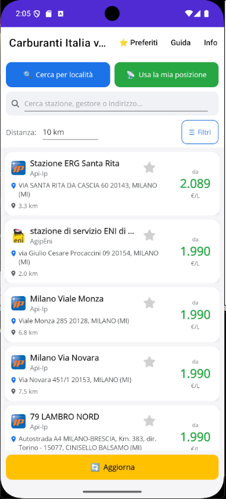
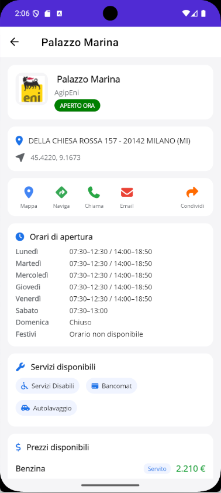
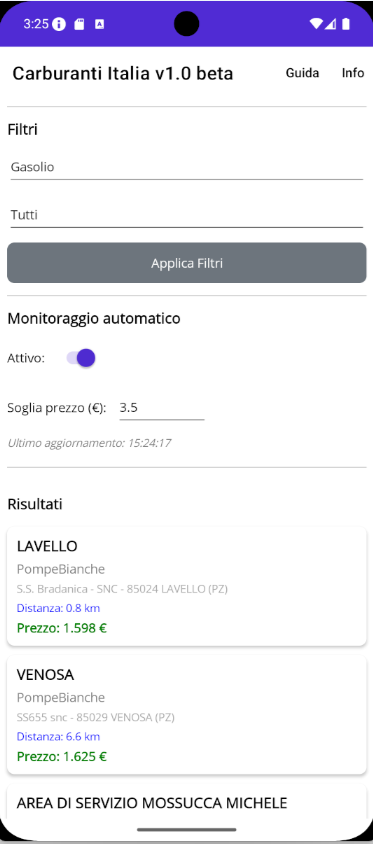
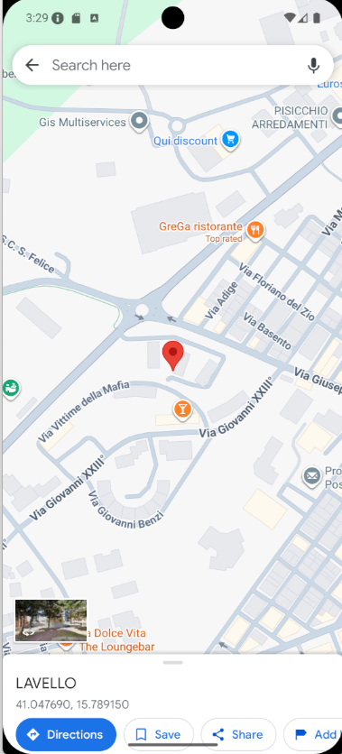

# 🚗 Carburanti Italia

App Android per consultare in tempo reale i **prezzi dei carburanti** in Italia.

---

## ✨ Funzionalità

- 🔍 Ricerca per **località** (Regione → Provincia → Comune)
- 📍 Ricerca per **posizione GPS**
- 📏 Raggio configurabile: 5, 10, 20, 30, 50, 100 km
- ⛽ Filtri: Benzina, Gasolio, GPL, Metano / Self, Servito, Tutti
- 💰 Risultati ordinati per **prezzo crescente**
- 🗺️ Apertura in **Google Maps**
- 🔔 **Monitoraggio automatico** con notifiche in background
- 📖 Guida e Info integrate

---

## 📸 Screenshot

---

## 📥 Download

👉 [**Scarica l'ultima versione**](https://github.com/maxsassano/CarburantiItalia/releases/latest)

**Requisiti:** Android 7.0 (API 24) o superiore, connessione internet, GPS (opzionale)

**Installazione:**
1. Scarica `CarburantiItalia.apk`
2. Sul telefono: **Impostazioni → Sicurezza → Origini sconosciute** (attiva)
3. Apri l'APK → **Installa**

---

## 🚀 Come si usa

**Prima ricerca**
1. Seleziona **Regione, Provincia, Comune**
2. Scegli la **distanza**
3. Tocca **Cerca per località** oppure **Usa la mia posizione GPS**

**Filtri** — Carburante, Modalità (Self/Servito/Tutti) → **Applica Filtri**

**Monitoraggio** — Attiva lo switch, imposta la **soglia prezzo**, ricevi notifiche quando trova prezzi sotto la soglia. Funziona anche ad app chiusa.

> ⚠️ Il monitoraggio in background consuma batteria.

---

## 🔌 Fonte dati

Tutti i prezzi provengono dall'**API pubblica del MIMIT** — Osservaprezzi Carburanti:
👉 https://carburanti.mise.gov.it

L'app **non è affiliata** al MIMIT né a marchi di carburante.

---

## ⚠️ Limitazioni

- I prezzi dipendono dalle comunicazioni dei gestori al MIMIT
- Il monitoraggio in background consuma batteria
- La ricerca per comune può essere lenta (usa OpenStreetMap)

---

## 📜 Licenza

MIT — vedi [LICENSE](LICENSE)

---

## 👤 Autore

**Massimo Sassano** — [@maxsassano](https://github.com/maxsassano)

---

  <b>Carburanti Italia v1.0 beta</b> 
  © 2026 Massimo Sassano

